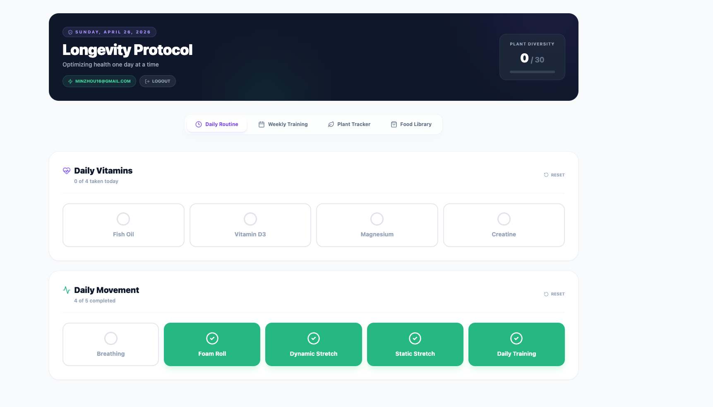

# Longevity Protocol Dashboard

This is a personal longevity protocol dashboard web application deployed using Firebase, React, and Vite.

This dashboard is personalized for me personally.

## Project Summary

The **Longevity Protocol Dashboard** is a personalized health and wellness tracking application. Built with modern web technologies, it provides a fast, responsive user interface for advanced data interaction and tracking.

### Key Technologies:

- **Frontend:** React, Vite (for fast builds and HMR)
- **Backend & Hosting:** Firebase
- **Data Validation:** Zod for strong schema validation and type safety



## Project Structure

Here is an overview of the core file structure and what each part of the application does:
Here is an overview of the core file structure and what each component handles:

```text
longevity-dashboard/
├── public/               # Publicly accessible static assets (e.g., favicons)
├── src/
│   ├── assets/           # Internal static assets (contains dashboard-image.png)
│   ├── components/       # Core React components for the dashboard features
│   │   ├── DailyVitals.tsx      # Tracks daily vitamin intake and mobility routines
│   │   ├── ExerciseLibrary.tsx  # Master catalog for viewing and managing custom exercises
│   │   ├── FoodLibrary.tsx      # Master catalog of bio-available nutrition and custom foods
│   │   ├── Header.tsx           # Top navigation header with user stats and logout functionality
│   │   ├── LoginView.tsx        # Authentication screen for Google Sign-In
│   │   ├── Navigation.tsx       # Sticky tab navigation to switch between dashboard views
│   │   ├── PlantTracker.tsx     # Tracks the weekly goal of eating 30 unique plant species
│   │   └── WeeklyTraining.tsx   # Detailed weekly workout logger with sets, reps, and copy/paste
│   ├── data/
│   │   └── constants.ts         # Centralized interfaces, default states, and master food/exercise lists
│   ├── utils/
│   │   └── textUtils.ts         # Utility functions (e.g., text normalization for searching/filtering)
│   ├── App.tsx           # Main application component, routing/state, and Firebase initialization
│   ├── App.css           # Global application styles and custom overrides
│   ├── main.tsx          # Application entry point that mounts React to the DOM
│   └── index.css         # Main stylesheet injecting Tailwind CSS directives
├── index.html            # Main HTML template for the Vite application
├── package.json          # Project metadata, NPM scripts, and dependencies
└── vite.config.ts        # Configuration for the Vite build tool
```

---

## Development & Firebase Deployment

Follow these structured instructions to run the application locally, make changes, and deploy updates to Firebase.

### 1. Local Environment Setup

First, ensure you have [Node.js](https://nodejs.org/) installed on your machine.

1. **Install Dependencies:**
   ```bash
   npm install
   ```

2. **Environment Variables:**
   Create a `.env` file in the root of the project to store your Firebase credentials. For local development, copy the credentials from the existing `.env` or set up the following keys:
   ```env
   VITE_FIREBASE_API_KEY=your_api_key
   VITE_FIREBASE_AUTH_DOMAIN=your_auth_domain
   VITE_FIREBASE_PROJECT_ID=your_project_id
   VITE_FIREBASE_STORAGE_BUCKET=your_storage_bucket
   VITE_FIREBASE_MESSAGING_SENDER_ID=your_sender_id
   VITE_FIREBASE_APP_ID=your_app_id
   VITE_FIREBASE_MEASUREMENT_ID=your_measurement_id
   ```

### 2. Local Development

Run the Vite development server to test changes in real-time with Hot Module Replacement (HMR):

```bash
npm run dev
```

The application will be served locally at [http://localhost:5173](http://localhost:5173). Any edits to the source code (e.g., in `src/components/` or `src/App.tsx`) will immediately reflect in the browser.

### 3. Deploying to Firebase

This project uses **Firebase Hosting** to serve the static production bundle.

#### Step A: Authenticate with Firebase
Authenticate the Firebase CLI with your Google account.
```bash
npx -y firebase-tools@latest login
```
> [!NOTE]
> If you are working in a headless/remote environment (such as an SSH session or remote container), use the following command instead to generate a login URL:
> `npx -y firebase-tools@latest login --no-localhost`

#### Step B: Build the Application
Compile the TypeScript and React source code into a highly optimized, production-ready static bundle under the `dist/` directory:
```bash
npm run build
```

#### Step C: Local Preview & Emulation (Recommended)
Before pushing to production, verify the production build locally.

* **Option 1: Vite Preview** (Spins up a local server serving the `dist/` directory)
  ```bash
  npm run preview
  ```
* **Option 2: Firebase Emulator** (Simulates the production Hosting configuration and rules locally)
  ```bash
  npx -y firebase-tools@latest emulators:start --only hosting
  ```
  This serves the build at [http://localhost:5000](http://localhost:5000).

#### Step D: Deploy to Production
To push the compiled bundle to your active Firebase project hosting target (`longevity-dashboard-46509`):
```bash
npx -y firebase-tools@latest deploy --only hosting
```

Your live site will be deployed and accessible at:
- [https://longevity-dashboard-46509.web.app](https://longevity-dashboard-46509.web.app)
- [https://longevity-dashboard-46509.firebaseapp.com](https://longevity-dashboard-46509.firebaseapp.com)

---

### 4. Deploying to a Preview Channel

To test features on a temporary, secure URL before deploying them to the live production site, you can deploy to a temporary preview channel:

```bash
npx -y firebase-tools@latest hosting:channel:deploy CHANNEL_ID
```
Replace `CHANNEL_ID` with a name (e.g., `new-vitals-ui`). This will create a secure link like `longevity-dashboard-46509--new-vitals-ui-RANDOM_HASH.web.app` which automatically expires after **7 days** (by default).

To customize the expiration time (e.g., 1 day):
```bash
npx -y firebase-tools@latest hosting:channel:deploy CHANNEL_ID --expires 1d
```

